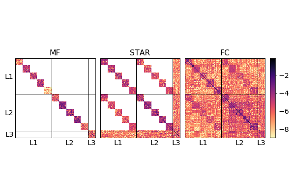

# Structured-DGP

This is the companion code for the inference methods for deep Gaussian Processes
reported in the paper [Beyond the Mean-Field: Structured Deep Gaussian Processes Improve the Predictive Uncertainties by Jakob Lindinger et al.](https://arxiv.org/abs/2005.11110).
The code allows the users to experiment with the proposed DGP inference method.
Please cite the above paper when reporting, reproducing or extending the results.

<p align="center">
  
</p>

## Purpose of the project

This software is a research prototype, solely developed for and published as
part of the publication cited above. It will neither be
maintained nor monitored in any way.

## Requirements

The Structured-DGP core code requires gpflow, tensorflow, tensorflow_probability, numpy, and scipy.
Running the demo additionally requires sklearn.
For running the unittests, unittest and [doubly_stochastic_dgp](https://github.com/ICL-SML/Doubly-Stochastic-DGP) are also needed.

A possible environment fulfilling the dependencies consists of
python 3.6.9
tensorflow 1.13.1
tensorflow-probability 0.6.0
gpflow 1.3.0

## Usage

The Structured-DGP interface is similar to the one of doubly_stochastic_dgp.
An exemplary usage is demonstrated in `demo/example_boston.py`.
The demo can be executed by running

```
python example_boston.py
```
from the _demo_ directory.

To run the unittests, from the root directory execute

```
python -m unittest discover tests/
```

Naively trying out new structural approximations to the covariance structure can be done
by implementing a new _DGP_ and a new _layers_ class as shown with
_Approx_Full_DGP_ in `stuctured_dgp/full_dgp.py` and _Stripes_Arrow_Layers_ in `stuctured_dgp/all_layers.py`.

## License

Structured-DGP is open-sourced under the AGPL-3.0 license. See the
[LICENSE](LICENSE) file for details.

For a list of other open source components included in Structured-DGP, see the
file [3rd-party-licenses.txt](3rd-party-licenses.txt).
